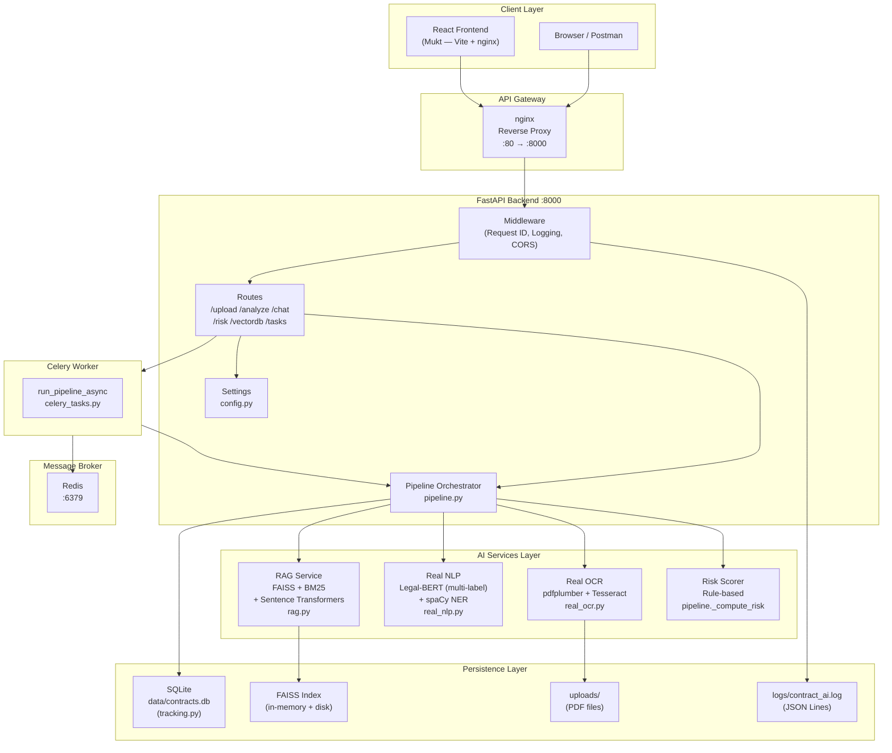
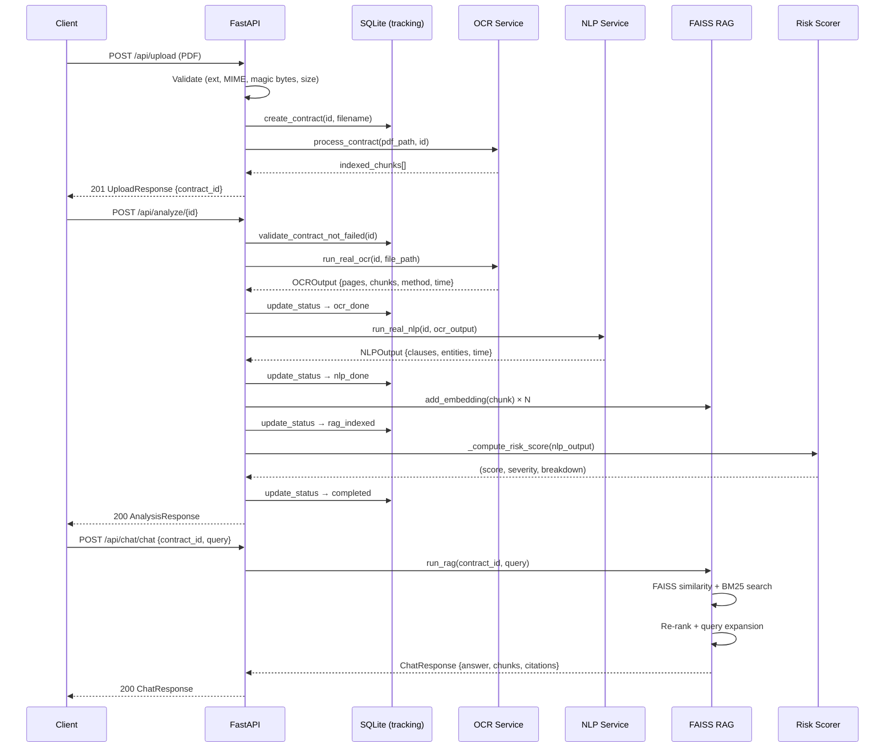
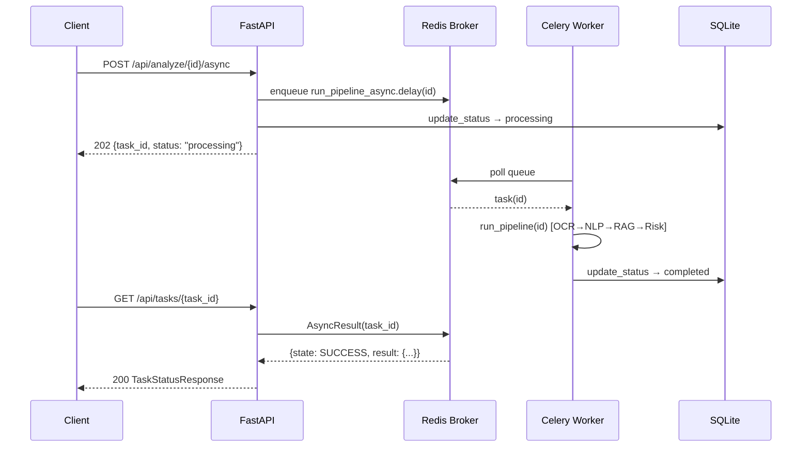

# Architecture — Contract Intelligence AI

> **Version:** 0.6.0  
> **Role:** Backend / API Engineer (Rushabh)  
> **Last Updated:** Day 27

---

## Overview

Contract Intelligence AI is an AI-powered legal contract analysis platform.
Users upload PDF contracts and receive structured analysis including:
- OCR-extracted text
- Legal clause classification (Legal-BERT)
- Named entity recognition (spaCy)
- Semantic Q&A (FAISS RAG)
- Explainable risk scoring

---

## System Architecture



---

## Analysis Pipeline (Sequence)



---

## Async Pipeline (Celery)



---

## Tech Stack

| Layer | Technology | Purpose |
|-------|-----------|---------|
| Web Framework | FastAPI 0.110+ | REST API, OpenAPI docs |
| Server | Uvicorn | ASGI server |
| Reverse Proxy | nginx | SSL termination, static files |
| Task Queue | Celery 5.x | Async pipeline execution |
| Message Broker | Redis 7 | Celery broker + result backend |
| ORM / DB | SQLAlchemy + SQLite | Contract tracking |
| OCR | pdfplumber + Tesseract | Text extraction |
| NLP | Legal-BERT (HuggingFace) | Multi-label clause classification |
| NER | spaCy `en_core_web_sm` | Named entity extraction |
| Embeddings | Sentence Transformers | Dense vector generation |
| Vector Store | FAISS | Similarity search |
| Keyword Search | BM25 (rank-bm25) | Hybrid retrieval |
| Containerization | Docker + docker-compose | Reproducible deployment |
| Cloud | AWS EC2 | Production hosting |
| Load Testing | Locust | Performance validation |
| Testing | pytest + httpx | Unit + integration tests |

---

## Directory Structure

```
Contract_Intelligence_AI/
├── main.py                       ← FastAPI app entry point
├── backend/
│   ├── config.py                 ← Centralized settings (env vars)
│   ├── celery_config.py          ← Celery app factory
│   ├── routes/
│   │   ├── upload.py             ← POST /api/upload
│   │   ├── contracts.py          ← GET /api/contracts[/{id}]
│   │   ├── analyze.py            ← POST /api/analyze/{id}
│   │   ├── async_analyze.py      ← POST /api/analyze/{id}/async + tasks
│   │   ├── risk.py               ← GET /api/risk/risk-score/{id}
│   │   ├── chat.py               ← POST /api/chat/chat
│   │   ├── vectordb.py           ← GET /api/vectordb/...
│   │   ├── frontend_analyze.py   ← Frontend-facing endpoints
│   │   └── rag_routes.py         ← RAG pipeline routes
│   ├── schemas/
│   │   ├── contract_schema.py    ← ContractMetadata, AnalysisResponse, ...
│   │   ├── ocr_schema.py         ← OCRChunk, OCROutput
│   │   ├── nlp_schema.py         ← ClausePrediction, EntityPrediction, NLPOutput
│   │   ├── rag_schema.py         ← ChatRequest, ChatResponse, ContractSummary
│   │   └── vectordb_schema.py    ← VectorDBStatusResponse, ChunkDetail, ...
│   ├── services/
│   │   ├── tracking.py           ← SQLite CRUD (SQLAlchemy)
│   │   ├── pipeline.py           ← Main pipeline orchestrator
│   │   ├── celery_tasks.py       ← Async task definitions
│   │   ├── real_ocr.py           ← pdfplumber + Tesseract integration
│   │   ├── real_nlp.py           ← Legal-BERT + spaCy integration
│   │   ├── rag.py                ← FAISS RAG retrieval service
│   │   ├── vectordb_service.py   ← Read-only FAISS inspection service
│   │   ├── mock_ocr.py           ← Dev mock (no Tesseract needed)
│   │   ├── mock_nlp.py           ← Dev mock (no GPU needed)
│   │   └── mock_rag.py           ← Dev mock (no FAISS needed)
│   └── utils/
│       ├── exceptions.py         ← Custom exception hierarchy
│       ├── validators.py         ← Reusable request validators
│       └── logging_config.py     ← Structured JSON logging
├── rag/                          ← Tisha's RAG pipeline
│   ├── chunking/preprocessor.py
│   ├── retrieval/embedder.py
│   └── vector_db/faiss_store.py
├── ocr/                          ← Sruthi's OCR pipeline
│   └── ocr_pipeline.py
├── models/
│   └── legal_bert_multilabel/    ← Charishma's trained model
├── tests/
│   ├── backend/
│   │   ├── conftest.py           ← TestClient + shared fixtures
│   │   ├── test_endpoints.py     ← Endpoint integration tests [Day 26]
│   │   ├── test_validators.py    ← Validator unit tests [Day 26]
│   │   ├── test_exceptions.py    ← Exception unit tests [Day 26]
│   │   ├── test_config.py        ← Config tests [Day 20]
│   │   ├── test_schema_contracts.py ← Schema tests [Day 19]
│   │   └── ...                   ← (additional test files)
│   └── load/
│       └── locustfile.py         ← Load testing [Day 25]
├── scripts/
│   ├── deploy.sh                 ← EC2 deployment script
│   └── healthcheck.sh            ← Docker healthcheck
├── docs/
│   ├── api_docs/api_reference.md ← Full API reference [Day 27]
│   ├── architecture/architecture.md ← This file
│   └── progress_tracker.md       ← Rushabh's progress log
├── Dockerfile                    ← Multi-stage prod image [Day 22]
├── docker-compose.yml            ← Local dev stack [Day 23]
├── docker-compose.prod.yml       ← EC2 production stack [Day 24]
└── .env.example                  ← Environment variable template [Day 20]
```

---

## Data Flow Summary

```
PDF Upload
   ↓ validate (ext + MIME + magic bytes + size)
   ↓ save to uploads/{contract_id}.pdf
   ↓ create_contract() → SQLite [status: uploaded]
   ↓ process_contract() → OCR → FAISS ingestion
   ↓ return contract_id to caller

POST /analyze/{id}
   ↓ validate_contract_not_failed()
   ↓ run_real_ocr() → OCROutput  [status: ocr_done]
   ↓ run_real_nlp() → NLPOutput  [status: nlp_done]
   ↓ add_embedding() × chunks    [status: rag_indexed]
   ↓ _compute_risk_score()        [status: completed]
   ↓ return AnalysisResponse

POST /chat/chat {contract_id, query}
   ↓ validate_contract_exists()
   ↓ validate_query()
   ↓ run_rag() → FAISS + BM25 retrieval → LLM answer
   ↓ return ChatResponse {answer, chunks, citations}
```

---

## Deployment Topology (AWS EC2)

```
Internet
   │
   ▼
[ EC2 Instance: t3.medium ]
   │
   ├── nginx:80/443  (SSL + reverse proxy)
   │       │
   │       ├── /         → React frontend (built static files)
   │       └── /api/*    → FastAPI :8000
   │
   ├── FastAPI (Uvicorn):8000
   ├── Celery Worker (x2 concurrency)
   └── Redis:6379
```

All services run via `docker-compose.prod.yml`. Secrets are injected via `.env.production`.

---

## Running the Test Suite

```bash
# Activate virtual environment
contract_ai_env\Scripts\activate   # Windows
source contract_ai_env/bin/activate # Linux/Mac

# Run all backend tests
python -m pytest tests/backend/ -v

# Run Day 26 tests specifically
python -m pytest tests/backend/test_endpoints.py \
                 tests/backend/test_validators.py \
                 tests/backend/test_exceptions.py -v

# Run with coverage
python -m pytest tests/backend/ --cov=backend --cov-report=term-missing
```

---

## Environment Variables Quick Reference

| Variable | Default | Description |
|----------|---------|-------------|
| `APP_ENV` | `development` | `development` / `staging` / `production` |
| `DEBUG` | `false` | Enable debug mode |
| `PORT` | `8000` | Uvicorn listen port |
| `CORS_ORIGINS` | `http://localhost:5173,...` | Allowed origins (comma-separated) |
| `MAX_FILE_SIZE_MB` | `20` | Upload size limit |
| `DATABASE_DIR` | `data` | SQLite directory |
| `LOG_LEVEL` | `INFO` | Logging level |
| `OCR_TESSERACT_CMD` | Windows path | Tesseract executable |
| `NLP_CONFIDENCE_THRESHOLD` | `0.30` | Clause detection threshold |
| `CELERY_BROKER_URL` | `redis://localhost:6379/0` | Celery broker |

See `.env.example` for the complete list with descriptions.
